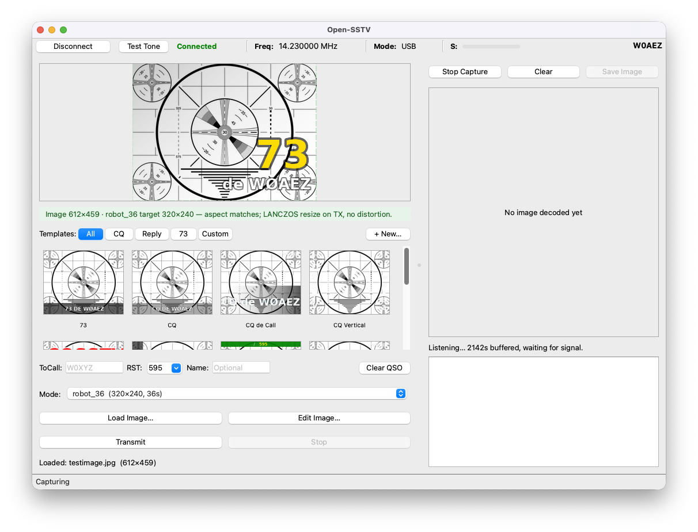
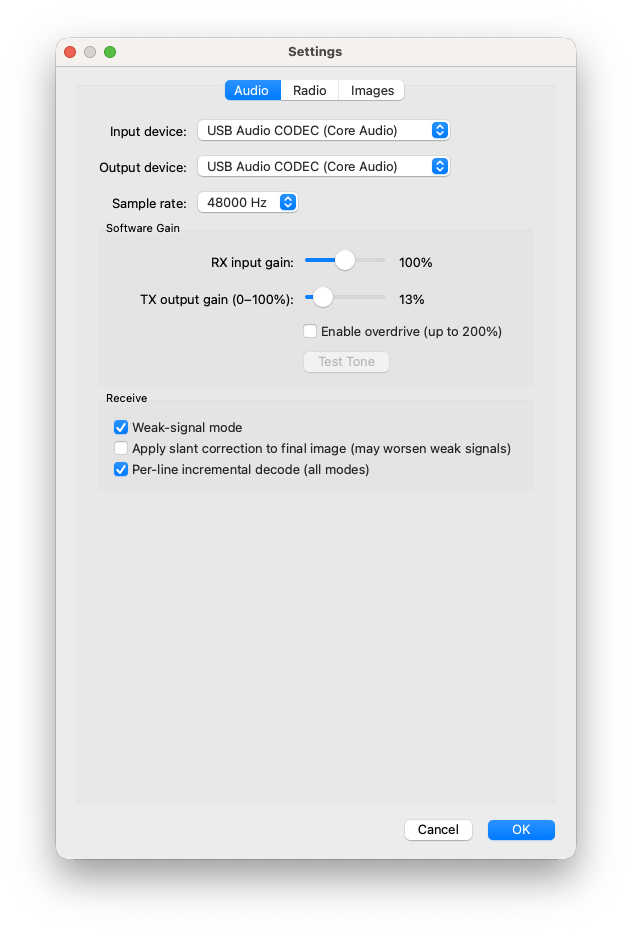
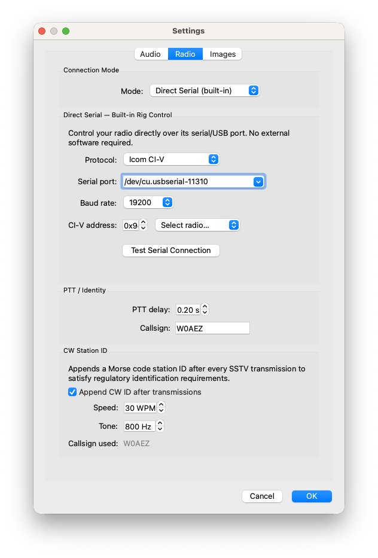
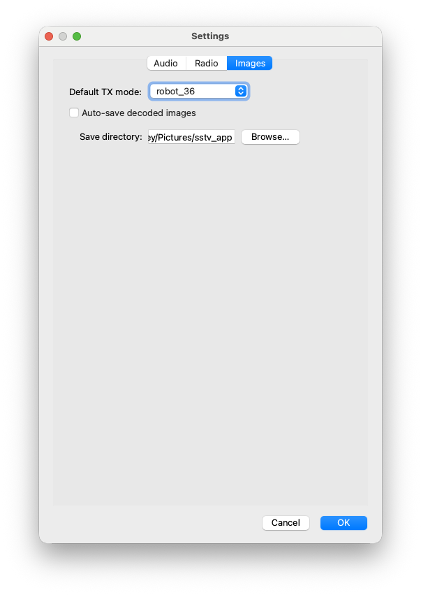
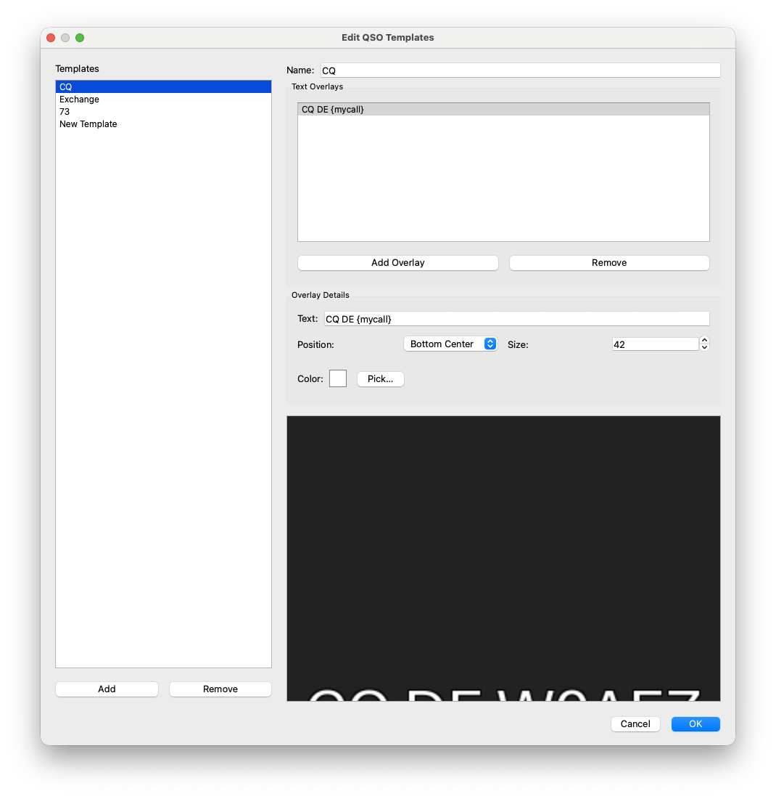
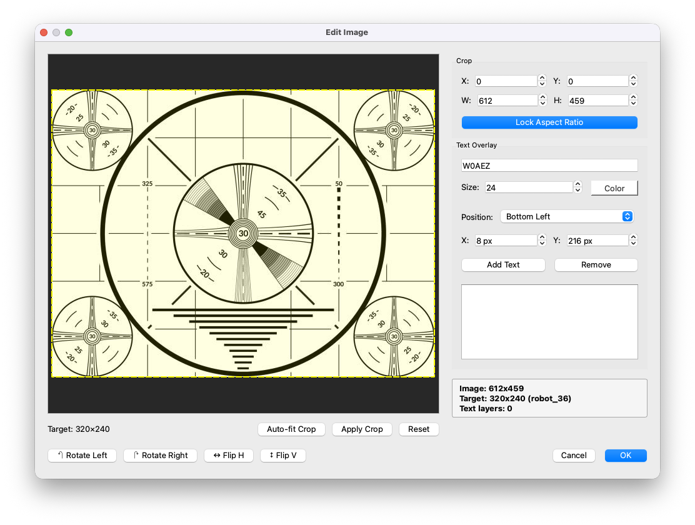
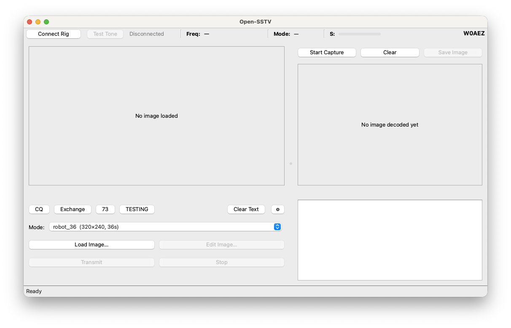

# Open-SSTV

An open-source, cross-platform SSTV (Slow Scan Television) transceiver for amateur
radio. Receives and decodes SSTV images live off your radio, and encodes and
transmits images back, with optional Hamlib or direct serial PTT and frequency control.

**Status: Beta (v0.2.3) — ready for user testing and feedback.** TX and RX paths work
end-to-end across all 22 supported modes. Rig control via rigctld or direct serial CAT
is functional. Weak-signal decode is usable down to roughly 0 dB SNR on Robot 36.

Open-SSTV is looking for testers — on-air reports, audio captures of problem decodes,
and UI feedback all welcome. Please
[file an issue](https://github.com/bucknova/Open-SSTV/issues) with your OS, Python
version, radio / interface, and any terminal output. See
[Testing focus areas](#testing-focus-areas) below for the spots we'd most like eyes on.

See [CHANGELOG.md](CHANGELOG.md) for the full release history. &nbsp;|&nbsp;
[User Guide](SSTV_App_User_Guide.md)

## Goals

- **Open source end-to-end**, GPL-3.0-or-later.
- **Cross-platform**: Linux x86_64 and macOS in v1; Raspberry Pi / ARM and Windows
  planned for v0.2.
- **Modern, intuitive UI** built on Qt 6 (PySide6).
- **Lightweight** enough to run on modest hardware. Pure Python + a small set of
  well-maintained scientific dependencies.
- **Real radio control** via Hamlib's `rigctld` TCP daemon or direct serial
  (Icom CI-V, Kenwood/Elecraft, Yaesu CAT, DTR/RTS PTT) — so any supported radio
  works out of the box without an external daemon.
- **Decoder written from scratch** because no maintained Python SSTV decoder exists
  on PyPI today. Algorithms mirror the well-known C reference `slowrx`.

## Features

### Transmit (TX)
- **22 SSTV modes** -- Robot 36, Martin M1/M2/M3/M4, Scottie S1/S2/DX/S3/S4, PD-50/90/120/160/180/240/290,
  Wraase SC2-120/180, and Pasokon P3/P5/P7. See the Supported Modes table below.
- **Image editor** -- crop, rotate, flip, and add text overlays (callsign, labels)
  before transmitting. Crop is locked to the target mode's aspect ratio. Text
  overlays support both named position presets (Top/Center/Bottom × Left/Center/Right)
  and pixel-precise X/Y spin boxes for fine placement.
- **QSO templates** -- one-click text overlays for common QSO phases (CQ, Exchange,
  73). Placeholder variables (`{mycall}`, `{theircall}`, `{rst}`, `{date}`, `{time}`)
  auto-fill from settings or prompt only for what's needed. Custom templates can be
  created, edited, and saved. Re-clicking a template auto-clears the previous text;
  a dedicated Clear Text button restores the clean image.
- **Correct Robot 36 encoding** -- custom line-pair encoder emits the canonical
  format that all real-world decoders (MMSSTV, SimpleSSTV, QSSTV, slowrx) expect.
  PySSTV's upstream Robot 36 produces a single-line format that most decoders cannot
  decode; Open-SSTV fixes this transparently.
- **PTT sequencing** -- keys the rig, waits for a configurable relay-settle delay
  (0–2 s, default 200 ms), plays SSTV audio, then de-keys. Works with rigctld,
  direct serial CAT, DTR/RTS, or manual (VOX).
- **CW station ID** -- optional Morse code callsign appended to every SSTV
  transmission (keyed under the same PTT). Satisfies the Part 97 identification
  requirement automatically. 15–30 WPM, 400–1200 Hz sidetone, 5 ms ramps to
  suppress key clicks. Test Tone is exempt (it's a calibration signal, not a
  communication). On by default; skipped silently with a warning if the callsign
  field is empty.
- **Test Tone** -- a 700 Hz + 1900 Hz two-tone signal at −1 dBFS peak for 5 s,
  triggered from the Radio panel or the Audio Settings tab. Used for ALC
  calibration; the TX output gain slider remains live during playback so the
  operator can tune without stopping the tone.
- **TX output gain** -- 0–100% slider with an optional "Enable overdrive"
  checkbox that expands the ceiling to 200% for setups where ALC won't move at
  100%. Most USB-audio rigs (IC-7300, FT-991A, etc.) sit in the 10–15% range
  with overdrive off.
- **TX banner** -- optional identification strip stamped across the top of every
  transmitted image. Shows your callsign flush-left and "Open-SSTV v{version}"
  flush-right. Three size presets (Small 24 px / Medium 32 px / Large 40 px)
  with matching font sizes, live preview in Settings, plus a "Preview on image…"
  button that shows the banner composited against a real photo before committing
  to TX. The source image is gently shrunk to fit below the strip so user content
  is never overwritten; output dimensions match the SSTV mode exactly.
  Configurable background and text colours; off by default.
- **Per-transmission TX watchdog** -- two-stage timer bounds PTT exposure on a
  stuck encoder or hung audio driver. Stage 1 (encode) is a fixed 30 s budget;
  stage 2 (playback) is computed from the actual encoded sample count plus PTT
  delay with a 20 % margin and a 30 s floor, so a stuck Robot 36 aborts in under
  a minute while Pasokon P7 still gets its ~500 s.
- **Rig-swap lockout** -- rig connect/disconnect controls are disabled for the full
  duration of a transmission so a mid-TX backend change cannot corrupt PTT state.
- **TX progress bar** with elapsed/total time (at the active sample rate) and percentage.
- **Stop button** -- abort mid-transmission; PTT is always de-keyed cleanly.

### Receive (RX)
- **Live decode** -- start capturing from any audio input, and decoded images appear
  in a scrollable gallery strip as they arrive.
- **Per-line incremental decoder** (default since v0.1.24) -- each scan line is
  decoded as soon as its sync pulse arrives rather than reprocessing the full
  growing audio buffer on every flush. O(1) work per line instead of O(N²) total,
  so the decoder stays ahead of real-time on Pi-class hardware even on the longest
  modes (Pasokon P7, Scottie DX). Covers all 22 modes including Robot 36's auto-
  detected per-line and line-pair wire formats. The legacy batch decoder is still
  available via a Settings toggle as a diagnostic fallback.
- **Progressive image preview** -- the partial image updates line-by-line during
  reception so you can see it build in real time.
- **Optional final slant correction** -- when enabled, a single-pass re-decode
  runs on the completed buffer with a global least-squares timing fit to
  compensate for TX/RX sound-card clock drift. Off by default: on weak or noisy
  signals the polyfit has no outlier rejection and can worsen the image. Robot 36
  is explicitly skipped (different color pipeline between the incremental and
  batch paths).
- **Weak-signal mode** -- optional relaxation of the VIS detection thresholds
  (leader presence 40 % → 25 %, start-bit minimum 20 ms → 15 ms) for signals
  audible in the noise that aren't triggering decode. False-positive VIS
  detections are handled gracefully (silent IDLE reset, no user-visible error).
- **Weak-signal robustness** -- bandpass prefilter, median-filter click rejection,
  and adaptive rolling-threshold sync detection. Usable decode down to ~0 dB SNR
  on Robot 36; partial decode at −5 dB.
- **RX-during-TX gate** -- the decoder is paused for the duration of every
  transmission, so the radio's own audio loopback never feeds back into the
  receive path. A 50 ms gate-off delay drains trailing RF before decode
  resumes; decoder state is reset between sessions to avoid stale residue.
- **Image gallery** -- horizontal thumbnail strip of the 20 most-recent decodes,
  newest first, with context-menu Save-As / Copy-to-Clipboard actions. Images
  are persisted to a per-session temp directory to release PIL buffers from
  memory immediately after the thumbnail is rendered (in-memory fallback if
  temp-dir creation fails).
- **Auto-save** -- optionally save every completed decode automatically to a
  configurable directory, with timestamped filenames
  (`sstv_<mode>_YYYYMMDD_HHMMSS.png`).
- **Save images** -- manual Save button, Ctrl+S shortcut, gallery double-click,
  or right-click → Save As…

### Radio Control
- **rigctld (Hamlib)** -- TCP client for `rigctld`, supporting PTT, frequency,
  mode, and S-meter. Auto-launch rigctld from the settings dialog.
- **Direct serial** -- connect to your rig without an external daemon:
  - **Icom CI-V** -- with preset picker for common models (IC-7300, IC-9700, etc.)
  - **Kenwood / Elecraft** -- standard Kenwood command protocol
  - **Yaesu CAT** -- Yaesu serial protocol
  - **PTT Only (DTR/RTS)** -- simple serial PTT via DTR or RTS line
- **Configurable baud rate** -- 4800, 9600, 19200, 38400, 57600, or 115200 baud.
- **Rig status bar** -- frequency, mode, and S-meter polled at 1 Hz when connected.
  Graceful disconnect: non-modal status bar message, auto-reconnect on next poll.

### Settings & Configuration
- **Audio device selection** -- separate input/output device pickers. RX input
  gain slider is 0–200 %; TX output gain slider is 0–100 % by default, expandable
  to 200 % with an "Enable overdrive" checkbox for setups where ALC won't move at
  100 %. Device changes take effect immediately; a saved-but-missing device
  surfaces a status-bar notice on startup rather than silently falling back.
- **Cross-platform serial port enumeration** -- uses `serial.tools.list_ports` for
  reliable port detection on Linux, macOS, and Windows. Port list is cached for
  5 s so repeated Settings opens don't re-enumerate USB hardware.
- **TOML-based config** -- all settings persist across sessions in a
  platform-appropriate config directory (`~/.config/open_sstv/` on Linux,
  `~/Library/Application Support/open_sstv/` on macOS,
  `%APPDATA%\open_sstv\` on Windows).
- **Resilient config loading** -- malformed or missing config and template files
  fall back to built-in defaults instead of crashing. Legacy key names
  (e.g. pre-v0.1.24 `experimental_incremental_decode`) are migrated automatically.
- **Callsign** -- saved in settings, pre-populated in the image editor's text
  overlay tool for quick QSO card creation, and used by both CW station ID and
  the TX banner.
- **Default TX mode** -- pre-select your preferred mode so it is ready each session.

### CLI Tools
- `open-sstv` -- launch the Qt desktop application.
- `open-sstv-encode` -- encode an image to an SSTV WAV file without the GUI.
- `open-sstv-decode` -- decode an SSTV WAV file back into an image without the GUI.
- Both CLI tools work without Qt installed, for headless or scripted use (Raspberry
  Pi, CI pipelines, batch processing).

## Supported Modes

All 22 modes support both TX (encode) and RX (decode).

| Mode | Resolution | Duration | Color System |
|------|-----------|----------|--------------|
| Robot 36 | 320×240 | ~36 s | YCbCr |
| Martin M1 | 320×256 | ~114 s | RGB |
| Martin M2 | 160×256 | ~57 s | RGB |
| Martin M3 | 320×128 | ~57 s | RGB |
| Martin M4 | 160×128 | ~29 s | RGB |
| Scottie S1 | 320×256 | ~110 s | RGB |
| Scottie S2 | 160×256 | ~71 s | RGB |
| Scottie DX | 320×256 | ~269 s | RGB |
| Scottie S3 | 320×128 | ~55 s | RGB |
| Scottie S4 | 160×128 | ~36 s | RGB |
| PD-50 | 320×256 | ~50 s | YCbCr |
| PD-90 | 320×256 | ~90 s | YCbCr |
| PD-120 | 640×496 | ~126 s | YCbCr |
| PD-160 | 512×400 | ~161 s | YCbCr |
| PD-180 | 640×496 | ~188 s | YCbCr |
| PD-240 | 640×496 | ~248 s | YCbCr |
| PD-290 | 800×616 | ~289 s | YCbCr |
| Wraase SC2-120 | 320×256 | ~122 s | RGB |
| Wraase SC2-180 | 320×256 | ~183 s | RGB |
| Pasokon P3 | 640×496 | ~203 s | RGB |
| Pasokon P5 | 640×496 | ~304 s | RGB |
| Pasokon P7 | 640×496 | ~406 s | RGB |

**Not yet implemented** (need custom YCbCr 4:2:2 encoders not in PySSTV): Robot 8,
Robot 12, Robot 24, Robot 72. Planned for a future release.

## Screenshots



*Main window — image loaded, QSO template buttons, mode selector, RX panel*

| | |
|---|---|
|  |  |
| *Audio tab — device, gain sliders, weak-signal mode* | *Radio tab — Direct Serial / Icom CI-V, PTT, CW Station ID* |
|  |  |
| *Images tab — TX banner with live preview* | *QSO Templates — CQ DE W0AEZ overlay editor* |
|  |  |
| *Image editor — crop, rotate, flip, text overlays* | *Main window — idle state at launch* |

## Architecture

```
PySSTV ──► encoder facade ──┐
   (Robot 36 uses custom    ├─► audio output ──► (radio TX via PTT)
    line-pair encoder)      │
                            │
       UI (Qt 6 / PySide6)──┤
                            │
       audio input ────────►├─► Decoder (FM demod -> VIS -> sync -> per-mode decode -> slant)
                            │       (pure NumPy/SciPy, no UI/IO deps)
       rigctld TCP ────────►│
       direct serial ──────►┘
```

The DSP `core/` is a pure-Python package with no UI, audio, or socket
dependencies -- it's unit-testable in headless CI and can be driven from a
different front-end (TUI, web, CLI) without modification.

## Install (development)

### Linux and macOS (supported)

```bash
git clone https://github.com/bucknova/Open-SSTV.git
cd Open-SSTV
python -m venv .venv
source .venv/bin/activate
pip install -e ".[dev]"
```

You will also need Hamlib's `rigctld` for rigctld-based radio control (not
required for direct serial or manual PTT):

- **macOS:** `brew install hamlib`
- **Debian/Ubuntu:** `sudo apt install libhamlib-utils`

### Windows (experimental — untested)

> ⚠️ **Open-SSTV has not been tested on Windows.** Every runtime dependency
> (PySide6, numpy, scipy, sounddevice, PySSTV, Pillow, pyserial) publishes
> Windows wheels, so the app *should* install and run, but no one has yet
> driven a real radio from Open-SSTV on Windows. Please treat the instructions
> below as a call for testers rather than a supported install, and
> [file issues](https://github.com/bucknova/Open-SSTV/issues) with your
> findings — good or bad. Full Windows support is on the
> [v0.2 roadmap](#v02-planned).

Prerequisites: Python 3.11+ from [python.org](https://www.python.org/downloads/)
(tick "Add Python to PATH" during install) and a working Git for Windows.

From a `cmd.exe` or PowerShell prompt:

```powershell
git clone https://github.com/bucknova/Open-SSTV.git
cd Open-SSTV
python -m venv .venv
.venv\Scripts\activate
pip install -e ".[dev]"
```

For rigctld-based radio control, download Hamlib for Windows from the
[official releases](https://github.com/Hamlib/Hamlib/releases) (pick a
`hamlib-w64-*.zip`), unzip somewhere permanent, and either add its `bin\`
folder to `PATH` or launch `rigctld.exe` manually before starting Open-SSTV.
Direct serial rig control (Icom CI-V, Kenwood, Yaesu, DTR/RTS PTT) does
**not** require Hamlib.

Known Windows caveats (expected, not yet verified on hardware):

- **Serial ports** appear as `COM3`, `COM4`, etc. — no `/dev/...` paths.
  `serial.tools.list_ports` enumerates them natively, so the Settings
  dialog's port picker should populate automatically.
- **Audio devices** — use the MME or WASAPI host API. ASIO is not exposed
  by `sounddevice` out of the box. If your USB interface doesn't appear,
  open it once in the Windows Sound control panel to register the endpoint.
- **Config directory** — settings persist to `%APPDATA%\open_sstv\`
  (via `platformdirs`), not the Linux/macOS paths mentioned elsewhere in
  this README.
- **`rigctld` auto-launch** from the Settings dialog assumes `rigctld` is
  on `PATH`; if not, launch it manually and connect Open-SSTV to
  `127.0.0.1:4532` instead.

## Run

```bash
open-sstv                                              # Qt desktop app
open-sstv-encode in.png --mode martin_m1 -o out.wav   # CLI encoder
open-sstv-decode in.wav -o out.png                    # CLI decoder
```

## Testing focus areas

If you're kicking the tyres on the v0.2.0 beta, these are the surfaces we'd most
like eyes on. File an [issue](https://github.com/bucknova/Open-SSTV/issues)
with what you tried and what happened.

- **Weak-signal RX**. Decode quality on fading / noisy signals; the weak-signal
  mode toggle (Settings → Audio → Receive); false-positive VIS detections (expected
  to reset silently — report if they don't).
- **RX decoder watchdog** (v0.1.36). Intentionally interrupt a transmission
  mid-image — does the partial image land in the gallery? Does the decoder return
  to IDLE cleanly for the next VIS?
- **TX output level calibration**. Test Tone button, output-gain slider, overdrive
  toggle. Does ALC move predictably? Any odd interactions with your rig's USB MOD
  Level or the OS system volume?
- **CW station ID**. At 15 / 20 / 30 WPM, with your real callsign. Audible and
  legible to a human copying by ear?
- **TX preview outline** (v0.1.37). Load an image, walk through the mode dropdown —
  does the green/amber match indicator track what you'd expect?
- **Rig control edge cases**. Mid-session USB unplug; rigctld daemon crash; Icom
  CI-V addresses other than the default 0x94; Kenwood/Yaesu protocol quirks.
- **macOS privacy prompts**. If you see Music / iCloud / unexpected access
  requests on launch, note which ones and when — we have a hunch this is PortAudio
  device enumeration but haven't nailed it yet.
- **Windows**. Open-SSTV has not been tested on real Windows hardware yet.
  Installation instructions are in [Install](#install-development); first-launch
  reports very welcome.

## Roadmap

### Post-beta / v0.3
- **Remaining SSTV modes** -- Robot 8/12/24/72 (4 modes needing custom YCbCr 4:2:2
  encoders not yet in PySSTV).
- **Waterfall display** -- live FFT spectrogram in the RX panel
  (scope: [docs/waterfall_scope.md](docs/waterfall_scope.md)).
- **Raspberry Pi / ARM support** -- tested on Pi 4/5.
- **Windows support** (validated on real hardware).
- **Digital VOX** -- auto-detect incoming SSTV and start decoding without manual
  capture start.
- **Drag-and-drop** image loading in the TX panel.

### Future
- **Expanded template library** -- a full set of premade QSO templates inspired by MMSSTV and other popular SSTV clients (signal reports, contest exchanges, ragchew layouts).
- **Received-image exchange** -- one-click workflow to auto-insert the last decoded image into the outgoing TX frame before sending.
- **Expanded font support** -- more typeface options for text overlays, including styles common in amateur radio use.
- **Advanced text layout** -- multi-column overlays, alignment controls, and background fill options for finer control over callsign and caption placement.
- FSKID transmission (CW ID already shipping — see Features → Transmit).
- ADIF QSO logging.
- PSK Reporter / DX cluster spotting.
- Installer packaging (.deb, .dmg, Flatpak).
- PyPI publish.
- Plugin/macro system.
- Internationalization.

### Considered and deferred
- **Optional image post-processing** — non-destructive "clean up image" action in
  the gallery (median filter for salt-and-pepper noise). Deferred: simple filters
  trade detail for smoother noise; more advanced denoisers (NLM, neural) bring
  significant dependency weight for mixed returns. May revisit if a concrete use
  case emerges.

## Author

Open-SSTV is developed by Kevin (W0AEZ).

## License

GPL-3.0-or-later. See [LICENSE](./LICENSE).
